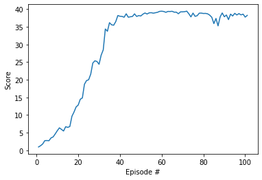

# Project 2: Continuous Control

### Introduction
This projects implements a Reinforcement Learning agent based on the DDPG algorithm. An agent is trained to aply torque on a robotic arm so that it reaches a moving target.

It is an implementation of the DDPG algorithm with Experience Replay and delayed training.

There are two versions of the Reacher Environment: 1 agent and 20 agents. This implementation is set to solve the latter.

### DDPG Implementation

The DDPG algorithm uses two agents, an actor and a critic. Each one has two networks, a local and a target one. 
The Actor is trained to give the best possible action, given the current state of the environment. (s => a).
The Critic agent is trained to give an estimate of the reward that'd be obtained if an action A is applied at the state S. ((s, a) => V)
Local networks are trained to get the "labels" given by the target. 

The DDPG algorithm was set to run up to 1000 episodes with at most 1000 iterations each. 

- Restart the environment to its initial state
- Observe the environment state
- The agent is allowed to navigate the environment for at most `1000 iterations`
  * Send the current state to the agent `act` function to get the corresponding action
  * Perform the selected action on the environment
  * Observe the new state, the reward, and check if the episode ended (done)
  * Accumulate the reward
  * Loop over the 20 agents and perform a training step with the state, action, reward, next_step and done tuple
  * Update current state with the new state of the environment
  * If the environment is done the finish the loop, otherwise continue
- Save the scores
- If the mean score of the last 100 episodes is 30 or more we've finished the training

Other Hyperparameters were set as:
BUFFER_SIZE = int(1e6)  # replay buffer size
BATCH_SIZE = 128        # minibatch size
GAMMA = 0.95            # discount factor
TAU = 1e-3              # for soft update of target parameters
LR_ACTOR = 1e-4         # learning rate of the actor 
LR_CRITIC = 1e-3        # learning rate of the critic
WEIGHT_DECAY = 0        # L2 weight decay
TRAIN_EVERY = 20        # How many iterations to wait before updating target networks
NUM_AGENTS = 20         # How many agents are there in the environment

### NN Model
The Neural Network Architecture of the `Actor` is the following:

- A Linear layer with 128 units (state_size, 128)
- A Batchnorm layer
- A Relu activation layer
- A Linear layer with 256 units
- A Relu activation layer
- A Linear layer with 4 units (action_size) 
- A Relu activation layer (Actions must be in the [-1, 1] range)

The Neural Network Architecture of the `Critic` is the following:

- A Linear layer with 128 units (state_size, 128)
- A Batchnorm layer
- A Relu activation layer
- A Linear layer with (256 + action_size) units (Here I concatenated the action with the encoded state)
- A Relu activation layer
- A Linear layer with 1 unit (This is the output layer)

### Plot of rewards
The rewards obtained during the agent training:

The weights of the Actor network are included in this repository: [Actor](checkpoint_actor.pth)
The weights of the Actor network are included in this repository: [Critic](checkpoint_critic.pth)

### Future Work
Although the requirement of +30 score was met, this doesnt look very well when you run the environment. +30 means it actually is away from the target ~70% of the time. So, to improve the agent's behavior, I'd say we could:
- Add one or two extra layers to the Actor and Critic networks.
- Consider the movement of the target by feeding the agent with a window of states.
- If using a window of states, maybe an RNN starting the network would be useful.